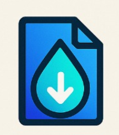

# 🔥 DropFade



**Secure, Anonymous, File & Text Sharing with One-Time Access**

DropFade is a modern, privacy-focused file sharing platform that allows you to share files and text notes securely with automatic deletion after a single access. No registration required, no tracking, complete anonymity.

## ✨ Features

- � **One-Time Access**: Files and notes are permanently deleted after being accessed once
- ⏰ **Time-Based Expiry**: Choose when your content should expire (5 minutes, 1 hour, or 1 day)
- 🚫 **No Registration**: Completely anonymous - no accounts, no tracking
- 📱 **QR Code Sharing**: Generate QR codes for easy sharing
- 🎨 **Modern UI**: Beautiful, responsive interface with dark mode support
- 🔒 **Secure Storage**: Files stored securely on Cloudinary with Redis session management
- 📄 **Text & Files**: Share both text notes and file uploads
- 🌐 **Cross-Platform**: Works on any device with a web browser

## 🚀 Quick Start

### Prerequisites

- Node.js 18+ 
- npm or pnpm
- Cloudinary account
- Upstash Redis instance

### Installation

1. **Clone the repository**
   ```bash
   git clone https://github.com/piyushrajyadav/dropfade.git
   cd dropfade
   ```

2. **Install dependencies**
   ```bash
   npm install
   # or
   pnpm install
   ```

3. **Set up environment variables**
   
   Create a `.env.local` file in the root directory:
   ```env
   # Cloudinary Configuration
   CLOUDINARY_CLOUD_NAME=your_cloud_name
   CLOUDINARY_API_KEY=your_api_key
   CLOUDINARY_API_SECRET=your_api_secret

   # Upstash Redis Configuration
   UPSTASH_REDIS_REST_URL=your_redis_url
   UPSTASH_REDIS_REST_TOKEN=your_redis_token
   ```

4. **Run the development server**
   ```bash
   npm run dev
   # or
   pnpm dev
   ```

5. **Open your browser**
   
   Navigate to [http://localhost:3000](http://localhost:3000)

## 🏗️ Tech Stack

- **Frontend**: Next.js 14, React 18, TypeScript
- **Styling**: Tailwind CSS, Radix UI Components
- **File Storage**: Cloudinary
- **Database**: Upstash Redis
- **Icons**: Lucide React
- **QR Codes**: react-qr-code


## 📖 How It Works

1. **Upload**: Choose a file or write a text note
2. **Configure**: Set expiration time (5 min - 1 day)
3. **Share**: Get a unique 6-character access code
4. **Access**: Recipients use the code to download once
5. **Auto-Delete**: Content is permanently deleted after access

## 🔧 Configuration

### Cloudinary Setup

1. Create an account at [Cloudinary](https://cloudinary.com)
2. Get your cloud name, API key, and API secret from the dashboard
3. Add them to your `.env.local` file

### Redis Setup

1. Create a Redis database at [Upstash](https://upstash.com)
2. Get your REST URL and token
3. Add them to your `.env.local` file


## 🔒 Security Features

- **One-Time Access**: Content is deleted immediately after download
- **Time-Based Expiry**: Automatic cleanup of expired content
- **No Persistent Storage**: No long-term data retention
- **Anonymous**: No user tracking or identification
- **Secure Transfer**: HTTPS encryption for all communications

## 🚀 Deployment

### Deploy to Vercel

1. **Connect your repository** to Vercel
2. **Add environment variables** in the Vercel dashboard
3. **Deploy** - Vercel will automatically build and deploy your app

### Deploy to Netlify

1. **Build the application**
   ```bash
   npm run build
   ```
2. **Deploy the `.next` folder** to Netlify
3. **Configure environment variables** in Netlify dashboard

### Docker Deployment

```dockerfile
FROM node:18-alpine
WORKDIR /app
COPY package*.json ./
RUN npm install
COPY . .
RUN npm run build
EXPOSE 3000
CMD ["npm", "start"]
```

## 🤝 Contributing

We welcome contributions!

1. Fork the repository
2. Create a feature branch (`git checkout -b feature/amazing-feature`)
3. Commit your changes (`git commit -m 'Add amazing feature'`)
4. Push to the branch (`git push origin feature/amazing-feature`)
5. Open a Pull Request

## 📝 License

This project is licensed under the MIT License - see the [LICENSE](LICENSE) file for details.

## 🛟 Support

- 📧 **Email**: piyushyadavrajyadav.com

## 🙏 Acknowledgments

- [Next.js](https://nextjs.org) - The React framework for production
- [Tailwind CSS](https://tailwindcss.com) - For beautiful, responsive styling
- [Cloudinary](https://cloudinary.com) - For reliable file storage
- [Upstash](https://upstash.com) - For serverless Redis
- [Radix UI](https://radix-ui.com) - For accessible UI components

---

<div align="center">
  <p>Built with ❤️ by the Piyush yadav </p>
  <p>
    <a href="https://dropfade.piyushyadav.me">Website</a> •
    <a href="https://github.com/piyushrajyadav/dropfade">GitHub</a> •
  
  </p>
</div>
- **Database**: Redis (Upstash) for metadata and TTL
- **Deployment**: Vercel-ready


## How It Works

1. **Upload**: User uploads a file or writes a text note
2. **Generate**: System generates a unique 6-character access code
3. **Store**: File goes to Cloudinary, metadata goes to Redis with TTL
4. **Share**: User shares the code or link
5. **Access**: Anyone with the code can access the content once
6. **Delete**: Content is automatically deleted after access or expiry

## API Routes

- `POST /api/upload/file` - Upload file to Cloudinary
- `POST /api/upload/text` - Save text note to Redis
- `GET /api/file/[code]` - Retrieve file/text by code
- `POST /api/file/[code]` - Mark as downloaded and delete

## Security Features

- No user accounts or tracking
- One-time access with automatic deletion
- Time-based expiry with Redis TTL
- File size limits (5MB default)
- Text length limits (1000 chars)
- Secure random code generation

## Customization

Edit these files to customize:
- `lib/utils.ts` - Code generation, file size limits
- `app/globals.css` - Styling and themes
- `components/` - UI components

## License

MIT License - feel free to use for personal or commercial projects.

## Contributing

Pull requests welcome! Please read the contributing guidelines first.
# dropfade
